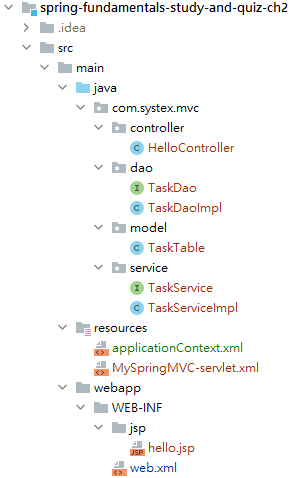

# Spring Fundamentals Self-Study and Quiz

## Chapter 2

本章節將練習使用 SpringMVC完成簡單的任務清單頁面，功能包含：

- 讀出Part3_Ch4所設定的table資料，且具刪除功能。
- 簡單的新增功能，並更新上方清單。

成品需具MVC分工概念，需完成`controller`、`dao`、`model`、`service`與`XML`相關類別與設定。

- `controller`負責處理網頁的請求。
- `service`負責於controller中提供服務。
- `dao`負責與DB的存取。
- `model`負責table相關設定。
- 前端以JSP(jstl)完成。
- DB以hibernate進行存取。
- Tomcat已於pom完成plugin設定，以`mvn tomcat7:run`即可啟動。

專案結構可參考：

